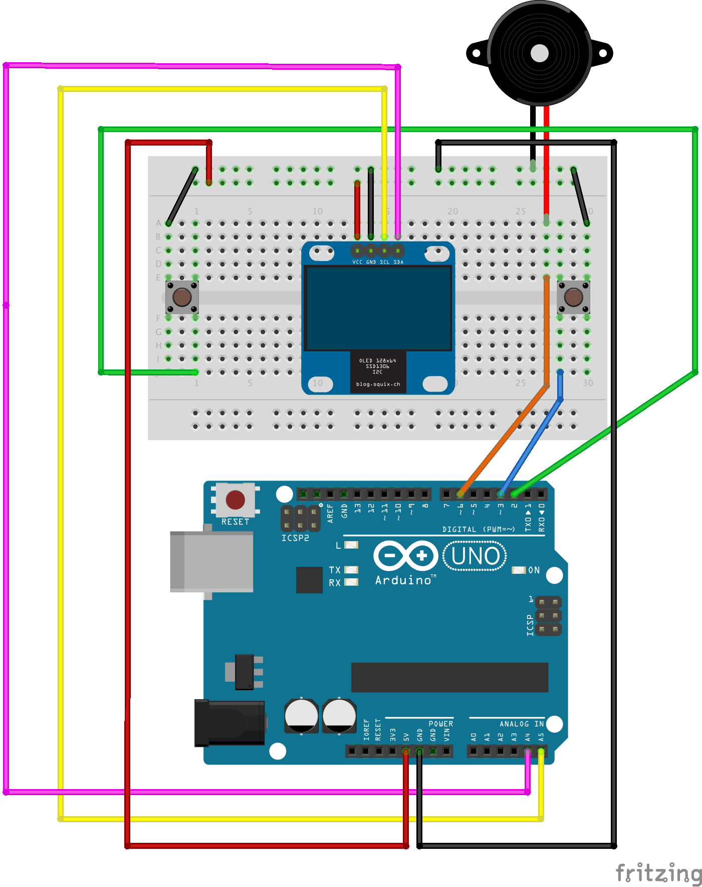

# pingpang-game
A ping pang game to demonstrate my Arduino game console platform. It uses SSD1306 OLED display and a buzzer as output, and two push buttons as input.

## Input

* `Push Button` x 2, due to the limitation of interrupt-supported digital pins, I only add two buttons. Add your own buttons to digital pins on demand.

## Outputs

* `SSD1306 OLED Display` x 1, here I use [u8glib](https://github.com/olikraus/u8glib) for rendering.
* `Piezo Buzzer` x 1, due to [the interference of tone()](https://www.arduino.cc/en/Reference/Tone) I use `analogWrite()` directly to trigger the beep.

## Wiring
